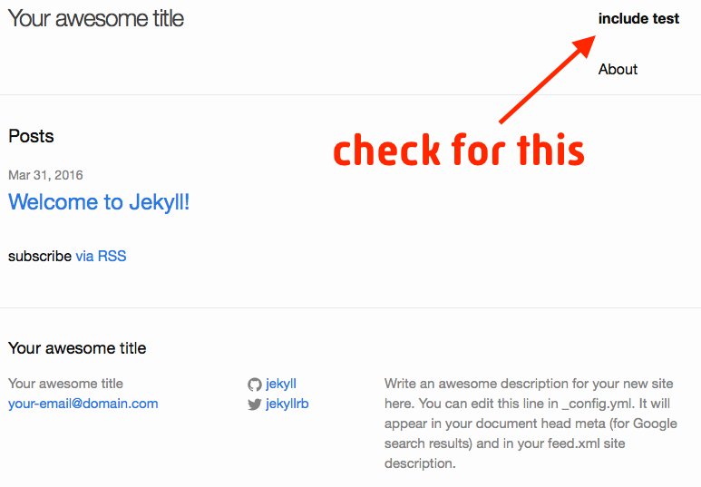

# Example app to show include bug

## Last tested with

Jekyll version 3.1.2

## To reproduce

### Steps

1. Clone this repo.
2. `jekyll build`

### Expected

Builds fine and shows a working jekyll blog with the text

> include test

in bold letters in the upper-right corner of the header, above 'About'.



### Instead

Building fails with message;

```
  Liquid Exception: Invalid syntax for include tag. File contains invalid characters or sequences: Valid syntax:  in _includes/header.html, included in _layouts/default.html
```

### Relevant

The include tag in question is in line 16 in `_includes/header.html`.
